# Banking-Information-System

Banking Information System in Java Swing

## Description

The Banking Information System is a desktop application developed using Java Swing. It provides functionalities for managing bank accounts, transactions, and customer information. This system is designed to offer a user-friendly interface for bank employees, customers and accountants to perform their tasks efficiently.

## Tools and Technologies Used

- Java
- Java Swing
- MySQL
- Eclipse
- iText Java Library (PDF Creation)

## Screenshots

| Screenshot 1 | Screenshot 2 |
|--------------|--------------|
| 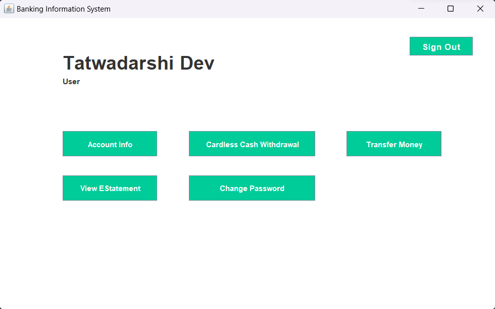 | 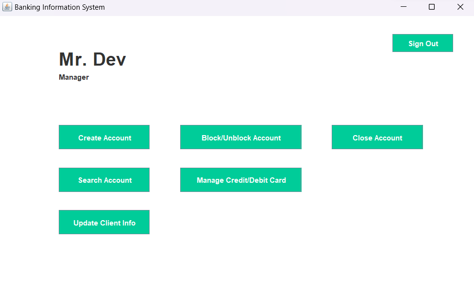 |
| 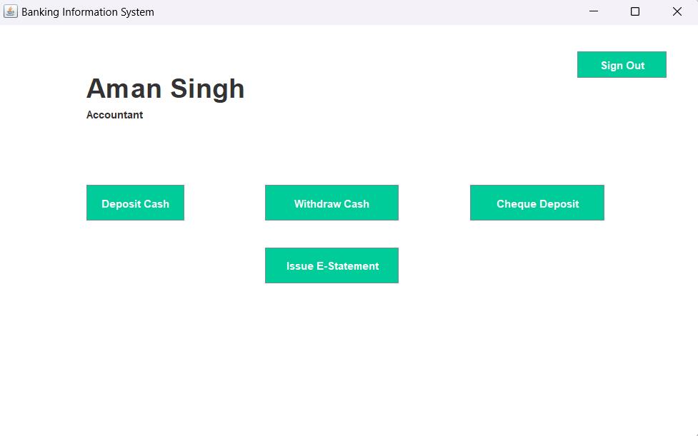 | 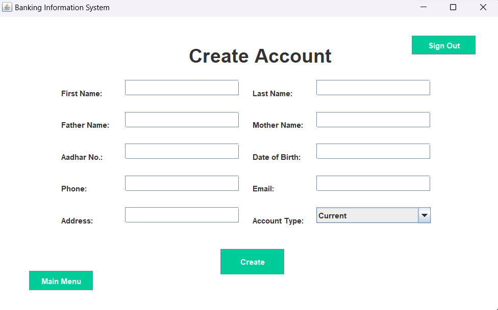 |
| 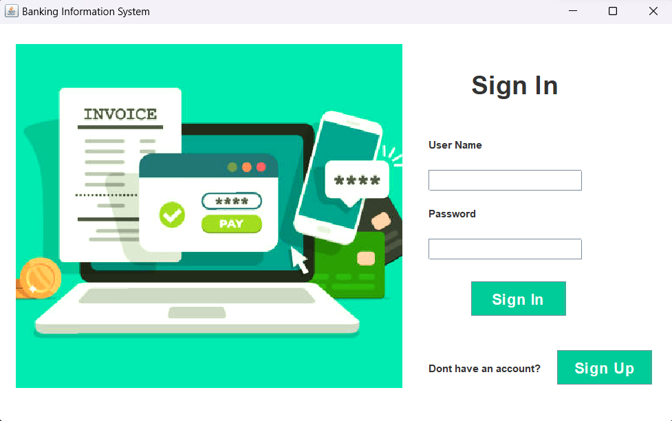 | 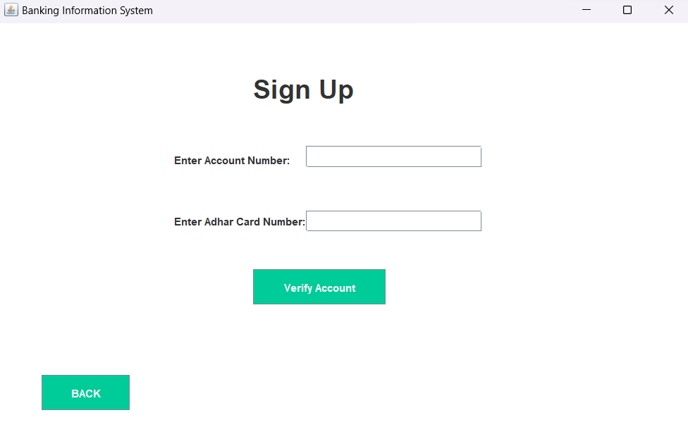 |
| 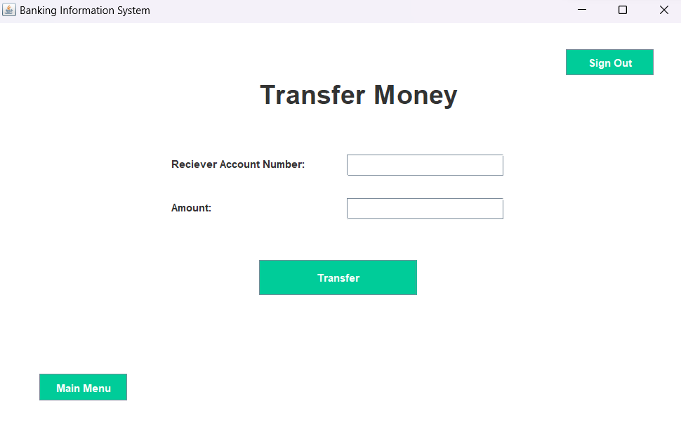 | 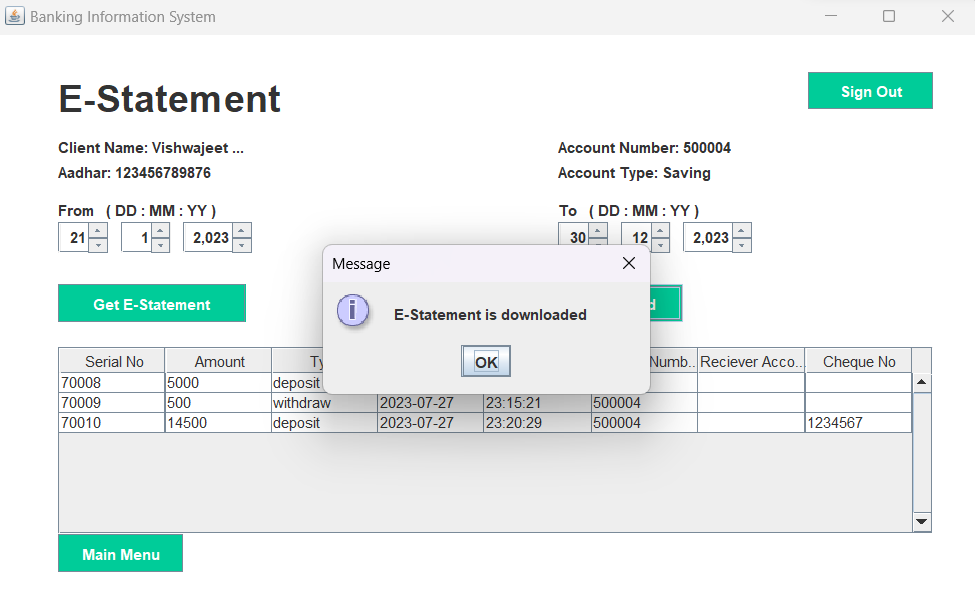 |
| 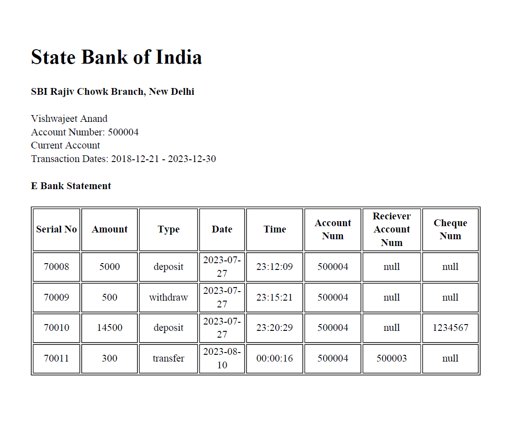 | 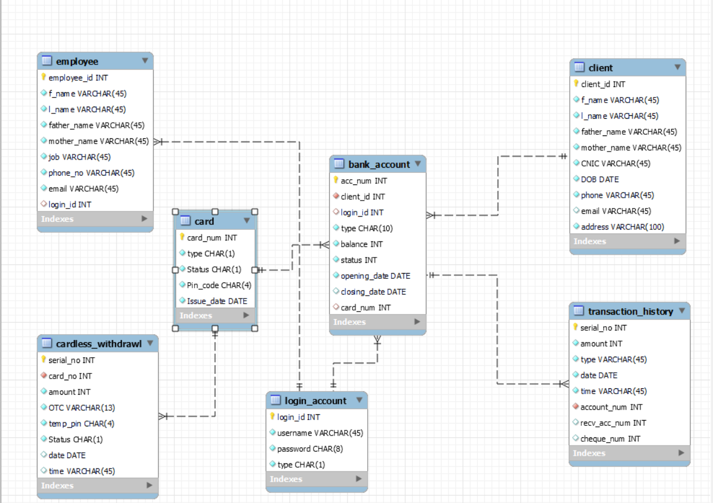 |
| 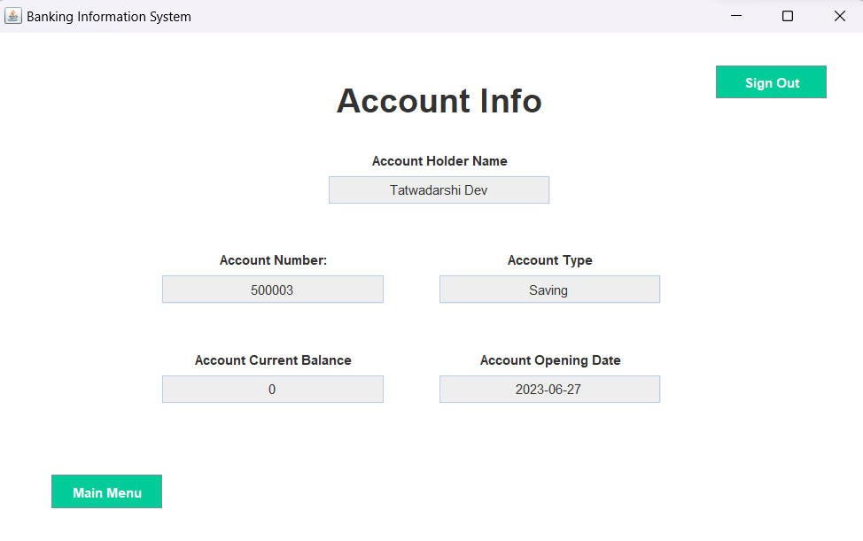 |

## License

This project is released under the [MIT License](LICENSE). You can find the specific terms and conditions outlined in the LICENSE file. This means you're free to utilize, modify, and distribute the project according to the terms of the MIT License.

## Contributors

- [Tatwadarshi](https://github.com/dev7091)